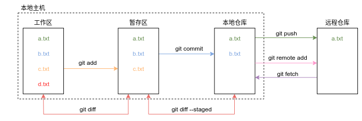

# learn-git

这个项目是用来学习git命令的用法，以及记录哪种情况应该用哪种命令。


## git 配置文件

列出当前配置

```bash
$ git config --list
```

修改全局配置（配置文件在 `~/.gitconfig` ）

```bash
$ git config --global user.name "xxx"
$ git config --global user.email "xxx@xxx.com"
```

修改本仓库配置（配置文件在 `<repo>/.git/config` ）

```bash
$ git config --local user.name "xxx"
$ git config --local user.email "xxx@xxx.com"
```


## git 别名

```bash
$ git config --global alias.ci commit
$ git config --global alias.cm 'commit -m'
```


## git 初始化仓库

在本地仓库创建新的 `git` 仓库（在项目的根目录下创建 `.git` 文件）

```bash
$ git init
```


## git 克隆仓库

把远程项目下载到本地

```bash
# Through SSH
$ git clone ssh://user@domain.com/repo.git

# Through HTTPS
$ git clone https://github.com/user/repo.git
```


## git 增

添加目录下的全部文件

```bash
$ git add .
```

添加目录下 .py 文件

```bash
$ git add *.py
```

可以使用`.gitignore` 文件忽略指定的文件

```txt
# no .a files
*.a

# but do track lib.a, even though you're ignoring .a files above
!lib.a

# only ignore the TODO file in the current directory, not subdir/TODO
/TODO

# ignore all files in the build/ directory
build/

# ignore doc/notes.txt, but not doc/server/arch.txt
doc/*.txt

# ignore all .pdf files in the doc/directory
doc/**/*.pdf
```


## git 删

删除未跟踪(untracked)的文件

```bash
$ rm file
```

删除暂存区的文件

```bash
$ rm file (delete the file)
$ git rm file (untracked the deleted file)
or
$ git rm -f file (delete the file & staged file)
```

删除远程仓库中的文件

```bash
$ git rm --cached file
$ git commit -m "delete files"
$ git push origin master
```

删除最后一次提交的文件

```bash
$ git rm —-cached <file-to-remove>
$ git commit —-amend
```


## git 改

取消暂存的文件，即取消该文件的跟踪

```bash
$ git rm --cached file
or
$ git restore --staged file
or 
$ git reset HEAD file
```

git 撤销对文件的修改

```bash
$ git restore file (git recommand)
or
$ git checkout -- file
```

git 重命名文件

```bash
$ git mv name_a name_b
```


## git 查



显示与上次提交时状态不同（更改、删除、添加）的文件（工作区与本地仓库的不同）

```bash
$ git status
```

以较短的形式显示状态信息

```bash
$ git status -s
```

显示尚未暂存（针对以跟踪的文件）的改动，而不是自上次提交以来所做的所有改动，即工作区和暂存区的区别

```bash
$ git diff
```

查看已暂存的将要添加到下次提交里的内容，即暂存区和本地仓库的区别

```bash
$ git diff --staged
```


## git log

基本用法

```bash
$ git log
```

显示每个commit下的详细修改信息

```bash
$ git log -p
```

显示最近两次提交log

```bash
$ git log -2
```

显示简略的log信息

```bash
$ git log --stat
```

改变log的输出格式

```bash
$ git log --pretty=oneline // show commit message in one line
$ git log --pretty=short   // show commit message and author
$ git log --pretty=full    // show more commit message and other infos
$ git log --pretty=fuller  // 比full多了提交时间
$ git log --pretty=format  // use a custom format to see the log
```

以图模式显示log信息

```bash
$ git log --pretty=oneline --graph
```

查看某个用户的所有提交

```bash
$ git log --author="username"
```

谁，在什么时间，修改了文件的什么内容

```bash
$ git blame <file>
```

log里的author指实际做出修改的人，committer是指最后将此工作提交到仓库的人


## git 提交

**commit将暂存区的文件提交到本地仓库**

提交时调用文本编辑器添加提交信息：

```bash
$ git commit
```

提交时添加单行提交信息（不建议使用）：

```bash
$ git commit -m "commit message"
```

修改最近的提交信息，这条命令会将暂存区的文件提交，如果自上次提交以来你还未做任何修改，那就只改变提交信息

```bash
$ git commit --amend
```

修改已经push的提交 (强烈不建议这么做)

**永远不要修复一个已经推送到公共仓库中的提交** 

```bash
$ git commit --amend
$ git push --force-with-lease origin master
```

补充遗漏的文件或信息

```bash
# add some files
$ git add some_files
# first commit
$ git commit -m "some commit"
# forgot some files to commit or need change some content in commented files, but still want to use last commit message
$ change content or add some new files
$ git add some_new_files_or_contents
$ git commit --amend           // 可以改变commit信息
or
$ git commit --amend --no-edit // 不改变commit信息，只新增文件
```

最终你只会有一个提交，第二次提交将替代第一次提交的结果


## git 分支

创建新分支

```bash
$ git branch <branch_name>
```

切换到新分支

```bash
$ git checkout <branch_name>
```

创建新分支并切换到新分支

```bash
$ git checkout -b <branch_name>
```

使用远程分支创建本地分支

```bash
$ git checkout -b <branch> origin/<branch>
eg:
$ git checkout -b temp origin/temp
or:
$ git checkout --track origin/temp
```

将当前的分支与远程分支关联

```bash
$ git branch -u <remote_name>/<branch>
```

解关联

```bash
$ git branch --unset-upstream
```

列出分支的详细信息

```bash
$ git branch -vv
```

列出所有的分支

```bash
$ git branch -a
```

列出所有的远端分支

```bash
$ git branch -r
```

删除本地分支

```bash
$ git branch -d <branch>
```

强制删除未提交的分支

```bash
$ git branch -D <branch>
```

删除远程分支

```bash
$ git push origin -d <branch>
```

合并某分支到当前分支

```bash
$ git merge <branch>
```

例如，我们此时在 `master` 分支，想要合并 `dev` 分支上的内容：

```bash
$ git merge dev
```

合并分支时禁用 `fast forward` :

```bash
$ git merge --no-ff
```

重命名本地分支

```bash
$ git branch -m old-name new-name

$ git push origin :old-name
$ git push origin new-name
```


## git 远程仓库

```bash
$ git remote add <shortname> <url> // 可以指定一个shortname用来代替url

$ git remote rm <shortname> // 移除一个远程仓库

$ git remote rename name_a name_b // 修改远程仓库的名字

$ git remote show <shortname> // 查看远程仓库的分支等信息

$ git fetch <shortname> // shortname 默认为origin

$ git push <shortname> <branch_name>
```

将远程库最新修改更新到本地仓库：

```bash
$ git pull
```

上面的命令相当于

```bash
$ git fetch <branch>
$ git merge <branch>
```

将本地分支与远程分支相关联：

```bash
$ git branch --set-upstream <branch> origin/<branch>
```


## git stash

将该分支上没有未提交的代码压入git栈中，将当前的工作目录恢复到上次提交的时候，方便我们做一些其他修改

```bash
# 将当前目录状态压入git栈
$ git stash
# 查看栈中的中存储的状态
$ git stash list
# 恢复一个栈中的状态
$ git stash pop
# 移除一个栈中的状态
$ git stash drop
```

默认情况下，`git stash`会缓存下列文件：

- 添加到暂存区的修改（staged changes）
- Git跟踪的但并未添加到暂存区的修改（unstaged changes）

但不会缓存一下文件：

- 在工作目录中新的文件（untracked files）
- 被忽略的文件（ignored files）

使用`-u`或者`--include-untracked`可以stash untracked文件。使用`-a`或者`--all`命令可以stash当前目录下的所有修改。


## git 变基

```bash
# 将temp分支的修改添加到master分支
$ git checkout temp
$ git rebase master
$ git merge master

# 取出client分支，找出处于client分支和server分支的共同祖先之后的修改，然后把它们在master分支上重放一遍
$ git rebase --onto master server client

# 将server分支的代码整合到master分支
$ git rebase master server
```


只要把变基命令当作是在推送前清理提交使之整洁的工具，并且只在从未推送至共用仓库的提交上执行变基命令，就不会有事。


## git标签

**Tag 就是只读的分支**

查看tag：

```bash
# 查看本地tag:
$ git tag

# 查看远程tag:
$ git tag -r
```

添加tag：

```bash
# 给当前版本添加tag:
$ git tag <tag-name>

# 给历史版本添加tag:
$ git tag <tag-name> commitid
```

删除tag：

```bash
# 删除本地标签:
$ git tag -d <tag-name>

# 删除远程标签：
$ git push origin -d <tag-name>
```

推送到远端仓库：

```bash
$ git push origin <tag-name>

# 推送所有未提交的tag:
$ git push origin --tags
```

更新到本地：

```bash
$ git pull origin --tags
```


## git cherry-pick

将某个分支的某些提交添加到另一个分支中


## License

MIT License
